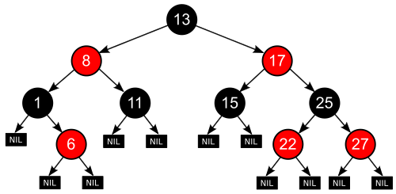

##
Implementação ~ :evergreen_tree: Árvore Rubro Negra 	:red_circle: :black_circle:
#### Para executar testes, use:
:black_small_square:	 npm test
##
#### Para criar a documentação, use:
:black_small_square:	 npm run docs
##
